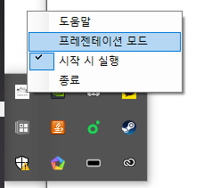
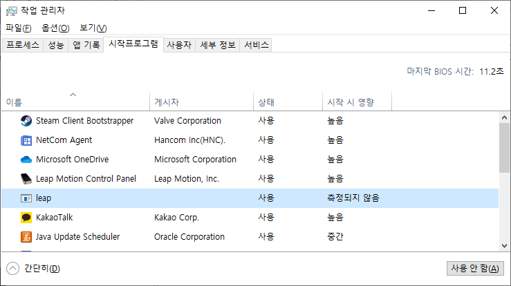
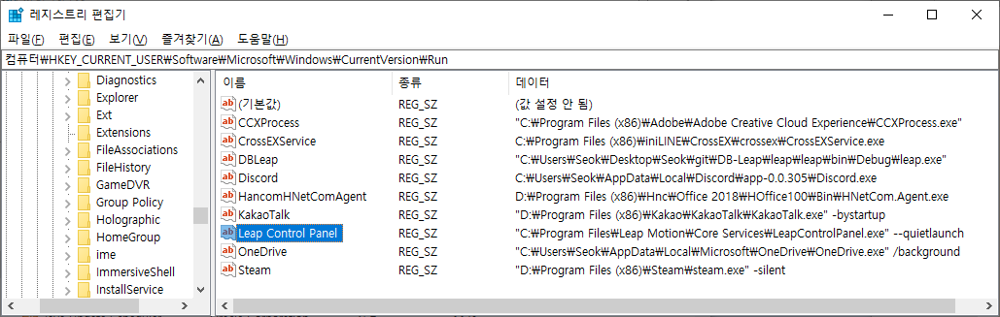
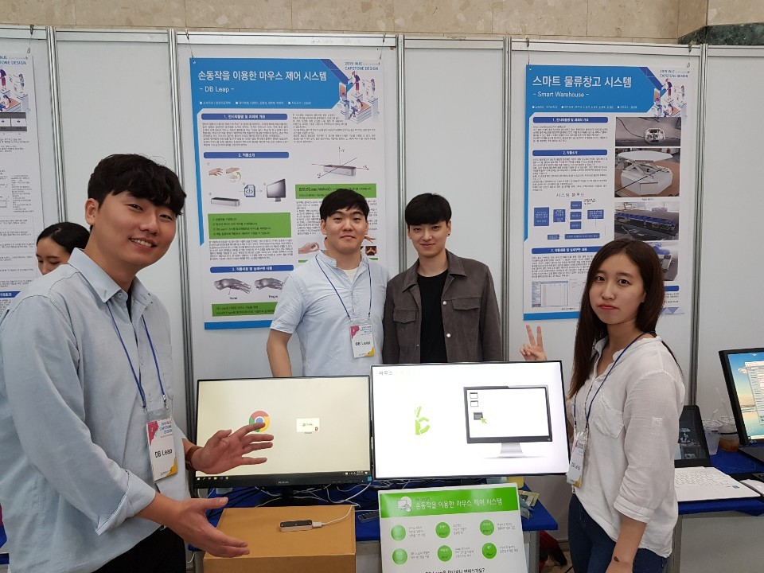
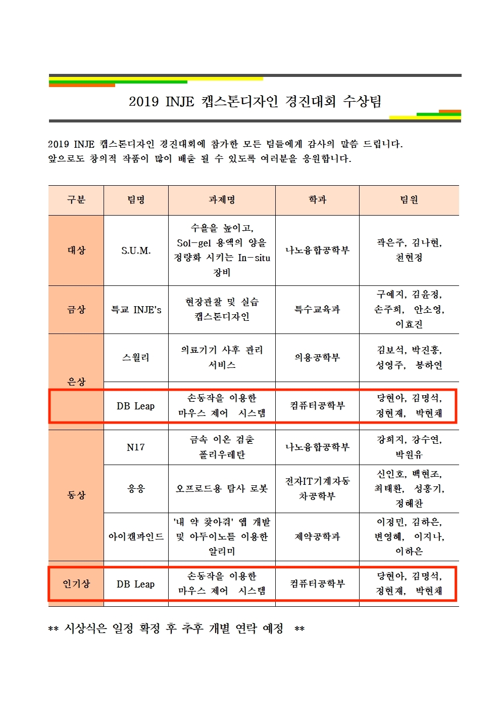
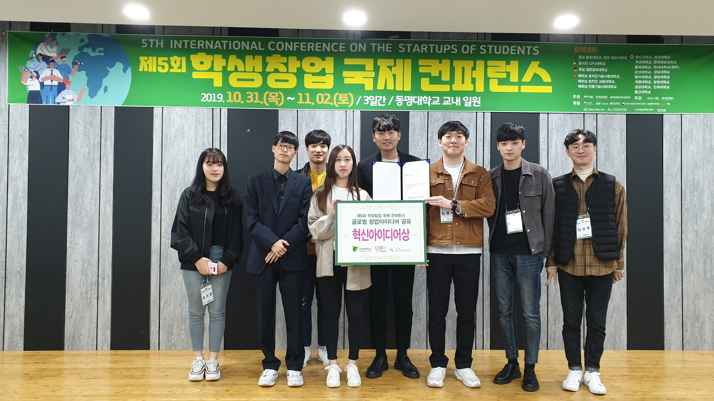

# 손동작을 이용한 마우스 제어 시스템

## 개발기간 / 개발인원
> 2019.09 ~ 2019.10 / 4명  

  

## 분야
> C# App, LeapMotion

  

## 개발 언어 / 개발 환경
> C#(.NET FrameWork) / Visual Studio

  

## 뉴스!
[인터넷 기사](https://www.inje.ac.kr/kor/Template/Bsub_page.asp?Ltype=5&Ltype2=1&Ltype3=0&Tname=S_TodayInje&Ldir=board/S_Focus&d1n=5&d2n=2&d3n=1&d4n=0&Lpage=Tboard_R&board_idx=1781&page=1)

  

## Preview

## 결과

